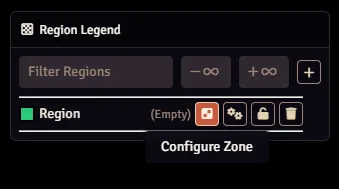
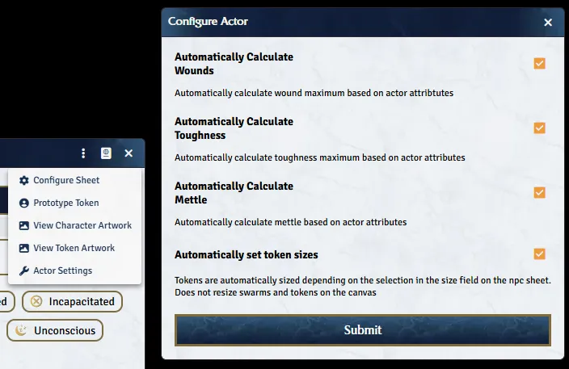

{: .warning}
While this covers the basics of using this system, it still assumes you know the basics of Foundry first. These concepts include most notably how Actors and Items and Effects interact with each other. You can find more information about basic Foundry concepts in the [Knowledge Base](https://foundryvtt.com/kb/).

{:toc}

## General Topics

Below are topics that should be known when using the system and can be described briefly. Topics that require more in-depth descriptions are given dedicated sub-pages.

### Zone Configuration

Zones are simply [Scene Regions](https://foundryvtt.com/article/scene-regions/). You can configure the Zone via the button in the Region legend. 

### Actor Settings

The Actor Settings menu lets you configure automated behavior within the Actor, namely disabling automatic calculations.

